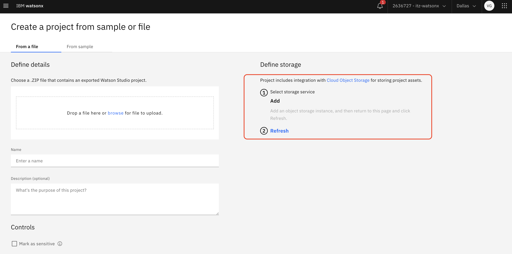
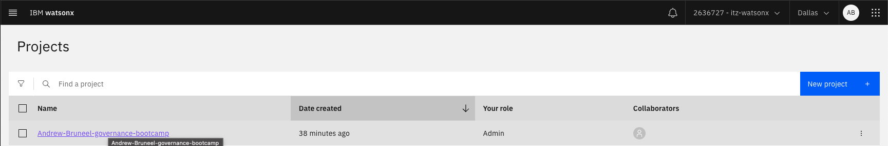
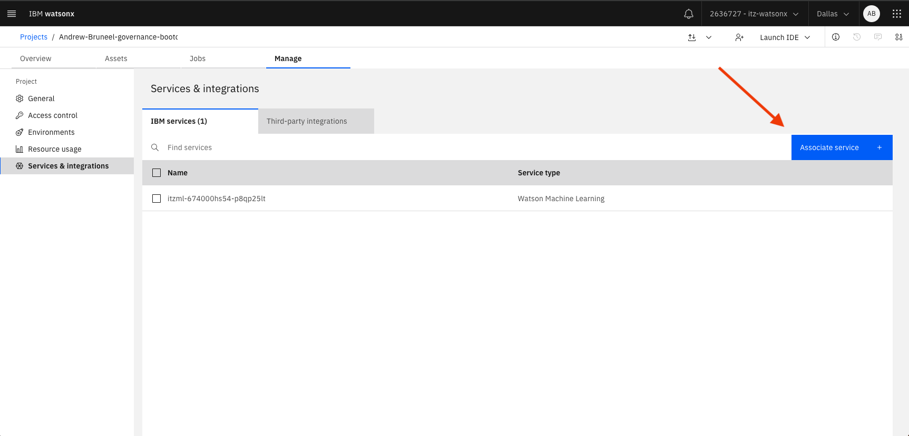
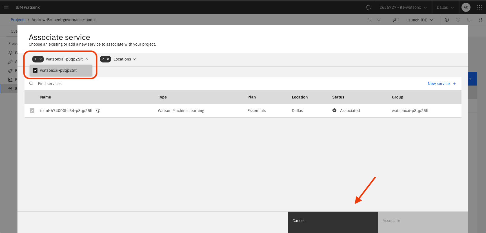
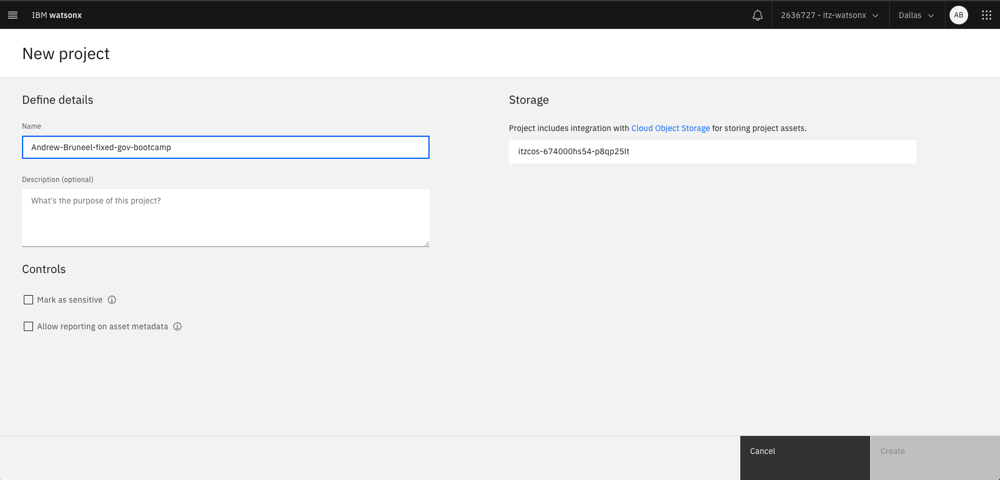

# Troubleshooting COS Issues
---

If you do not see any available COS instance to select when creating a project, your screen may look something like this:

If this is the case, there are a few simple steps you can follow in order to fix this error and move forward in your project creation. Start out by navigating to an old project that you have already created (The below project was created for the purpose of this demo).

After you have done this, select "Manage", then "Services and Integrations". From there, we want to click on the blue "Associate Service" button.

Now, click on the "Resource Groups" option in the top left, and select the available resource group in the filter. After you have done this, simply click the "Cancel" button.

Finally, navigate back to the project creation screen and attempt to make another project -- your screen should look something like this, with your COS now available!

# Why Can't I Create a Project on SaaS?
---

[IBM resource for troubleshooting](https://github.com/IBM/itz-support-public/blob/main/IBM-Technology-Zone/IBM-Technology-Zone-Runbooks/watsonx_troubleshooting_guide.md#why-cant-i-create-a-project-on-saas)