# Lab 0: Project Setup
---
## Summary
In this lab, we will be walking through how to create your own project to complete the following labs in the bootcamp. It is important we create a project in the right environment, or else it can cause issues down the line if done incorrectly!

## Table of Contents

  1. [Accept invitation to instance](#accept-invitation)
  2. [Log in to watsonx](#log-in-to-watsonx)
  3. [Check that you are in the right instance](#check-instance)
  4. [Create a new project](#new-project) 
  5. [Associate the correct WML instance](#wml-instance)
  6. [Create an inventory](#create-inventory)

**Note:** If you encounter some technical issues while working on the labs, please refer to this [troubleshooting document](../troubleshooting-tips.md).

### 1. Accept invitation to instance
---
If you are enrolled in the bootcamp, you will likely be working in a shared instance. You should have received an email asking you to join an instance from noreply@techzone.ibm.com with subject "[EXTERNAL] A reservation has been shared with you on IBM Technology Zone."

Join the instance by clicking HERE in "Please go HERE to accept your invitation" as in the image below. 

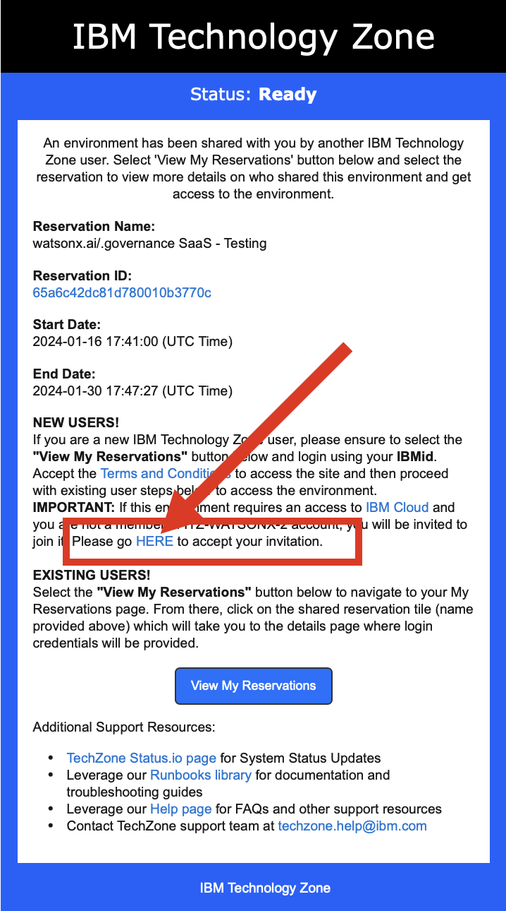

The following web page may or may not display. If it does, click (1) to select the correct Notification then (2) click "Join Now".

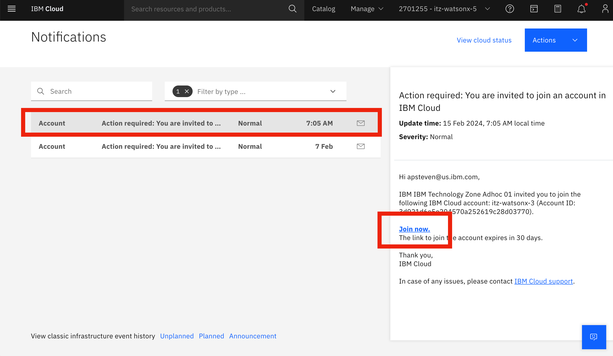

When this page displays, click the checkbox as in the image below then click "Join Account".

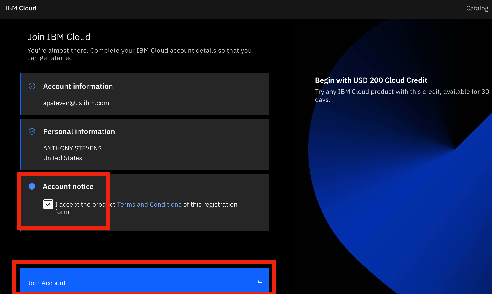

### 2. Log in to watsonx
---
Next, follow this link to log in to watsonx: https://dataplatform.cloud.ibm.com/wx/home?context=wx

### 3. Check that you are in the right instance
---
You should now be taken to the watsonx home screen. Check at the top right that you are in the right instance. If it does not show the right name of the instance, you can select it in the dropdown. For the entirety of the bootcamp, you will be working in that same instance!

**Note:** The instance at the top right tends to change to your default personal account every time you switch/go back to a new page. Thus, it's always good to check the top right corner every time you switch to a new page.

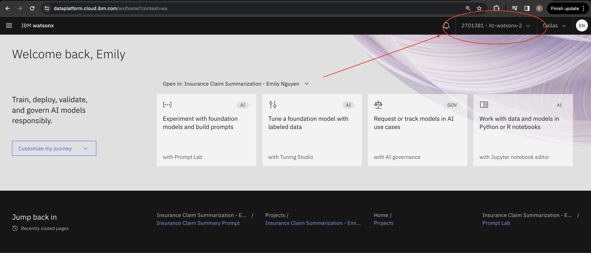

### 4. Create a new project
---
Now, we can go ahead a create a new project. In the **Projects** section at the bottom, click the "+" symbol next to it to create a new project.

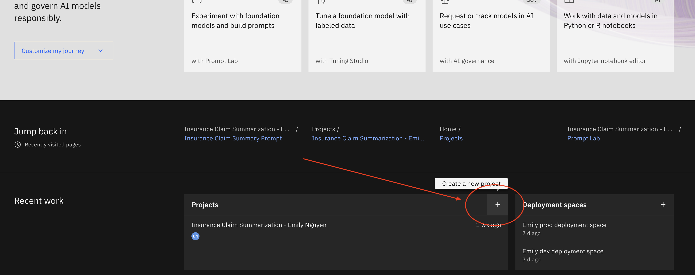

Enter a **unique name** for your project, include both your first and last name and any other information you would like.

### Cloud Object Storage (COS)
It is likely there is also already a Cloud Object Storage instance selected for you, with a name that starts with "itzcos-..." If so, you don't have to do anything! 

Otherwise you may be prompted to select from multiple instances. Please consult with your bootcamp lead which COS instance to select.

**However**, if there is no instance available, please follow the directions [here](COS_troubleshooting.md) to resolve the issue.

### Click Create
Now go ahead and click Create. It may take a few seconds to officially be created.

### 5. Associate the correct WML instance
---
With the project created, you should be directed to the project home page. Go ahead and select the "Manage" tab.

Click on "Services and Integrations" in the left side-bar. Then click on "Associate service."

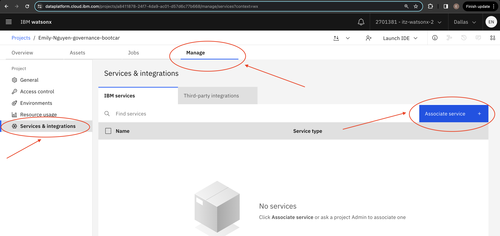

Select the service listed with "Type" = "Watson Machine Learning" and click **Associate**. 

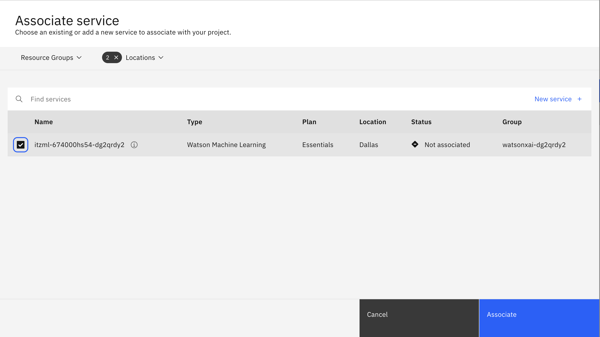

**Note:** If you can't find the service, remove all filters from the "Locations" dropdown. If you see 2+ Watson Machine Learning services, select the one where "Group" = the same *environment* name of the instance. The *environment* name can be found on https://techzone.ibm.com/my/reservations. 

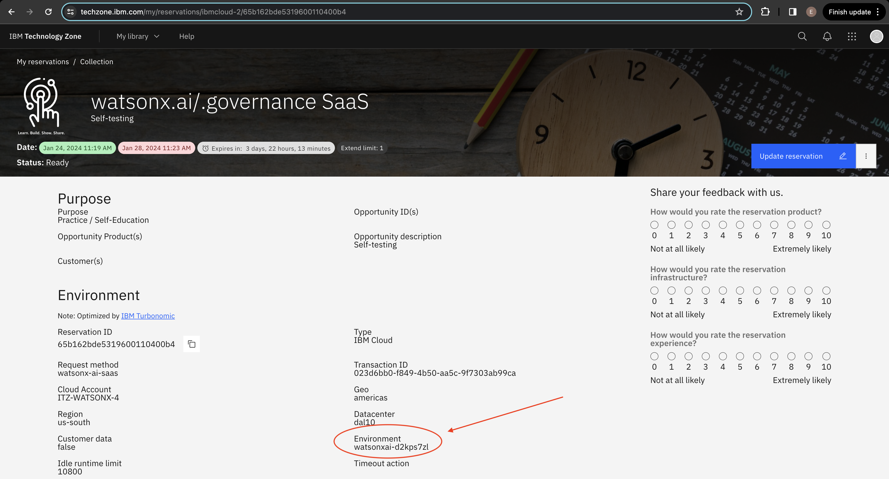

If you run into issues with creating a project, watch these two videos as examples.

Example 1: [Video](https://ibm.webex.com/ibm/ldr.php?RCID=ed095d208ed66bbf73bfc0a0f547ac6f) (Password: 93yP4Wgm)

Example 2: [Video](https://ibm.webex.com/ibm/ldr.php?RCID=240b3c5b217fc6ca1e51b3a8b9f92a33) (Password: uEfMJSN4)

### 6. Check that an inventory is created
---
Now that we have created a project, we'll need to create an inventory for Lab 2. Visit the watsonx home page, and on the left-hand side bar click on the "AI Governance" dropdown, then "AI use cases".

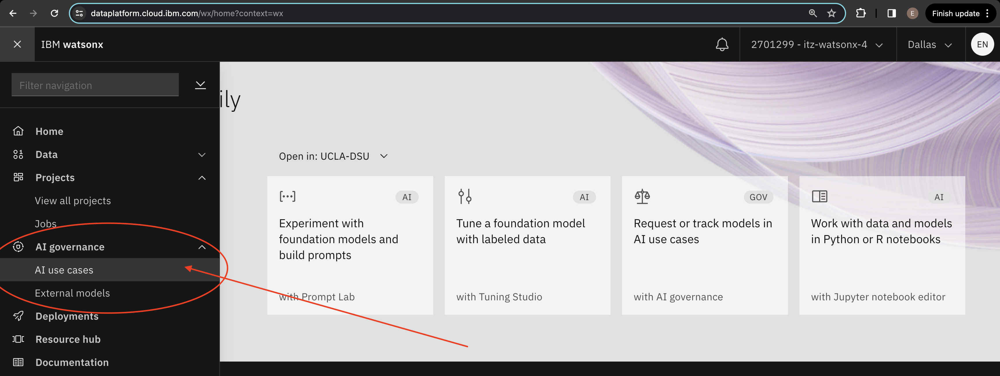

If you are directed to a page that says "No inventories available yet," click "Manage inventories" and create a new one.

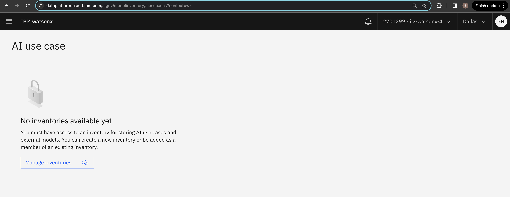

Otherwise, if you see some use cases listed in the page, you already have an inventory created and are all set! You are done with Lab 0 and can proceed with Lab 1. **Note:** If you are still interested in creating a new fresh inventory for the bootcamp, click the gear icon at the top. Then navigate to "Inventories" and follow the same instructions below.

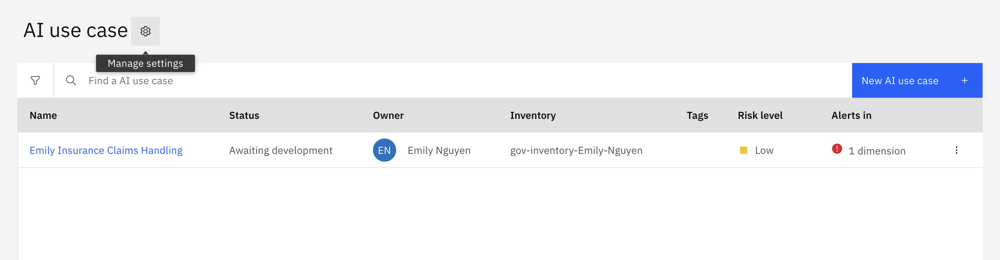

When creating your inventory, give it a unique name, and select the right COS instance. If there is more than one COS option, pick the one with the same *environment* name we discussed in [Step 5](#wml-instance) that's displayed in your TechZone reservation. 

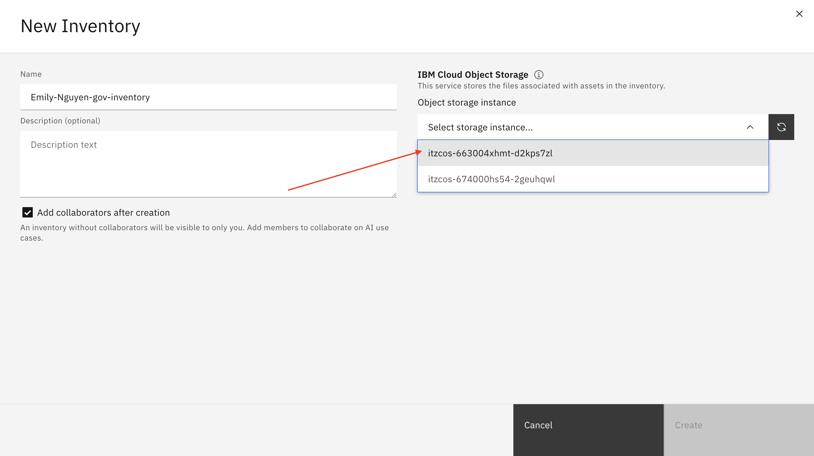

After setting up a project and inventory, you are now ready for the class!
