# Lab 1: Assisted Prompt Evaluation
---
<div align="center">
    
</div>

## Summary
---
In this lab, you will play the role of a **Prompt Engineer** and use watsonx.governance to create a prompt template, evaluate it against a dataset, and view the performance metrics. After that, you will explore your prompt's AI factsheet to learn how to modify thresholds for evaluations then experiment with different variants of your prompt templates as you attempt to achieve the best evaluation you can on our dataset! Good luck!

## Table of Contents

  1. [Creating a Prompt Template](#creating-a-prompt-template)
     1. [Prompt Variables](#prompt-variables)
     2. [Saving Prompt](#saving-prompt)
     3. [Model Parameters](#model-parameters)
  2. [Evaluating Your Prompt](#evaluating-your-prompt) 
  3. [Alternative Way to Evaluate Prompt](#alternative-evaluation)
  4. [Evaluation Results](#evaluation-results)
  5. [Experimenting With New Prompts](#experimenting-with-new-prompts)
     1. [Using Granite](#using-granite)
     2. [Your Choice!](#your-choice)
  6. [Experimenting With Settings](#experiment-with-settings)

---
### 1. Creating a Prompt Template<a name="creating-a-prompt-template"></a>
---
Let's begin creating our first prompt. Head over to the "Assets" tab of the project home page, again from the top of your screen. Once there, click on "New Asset".

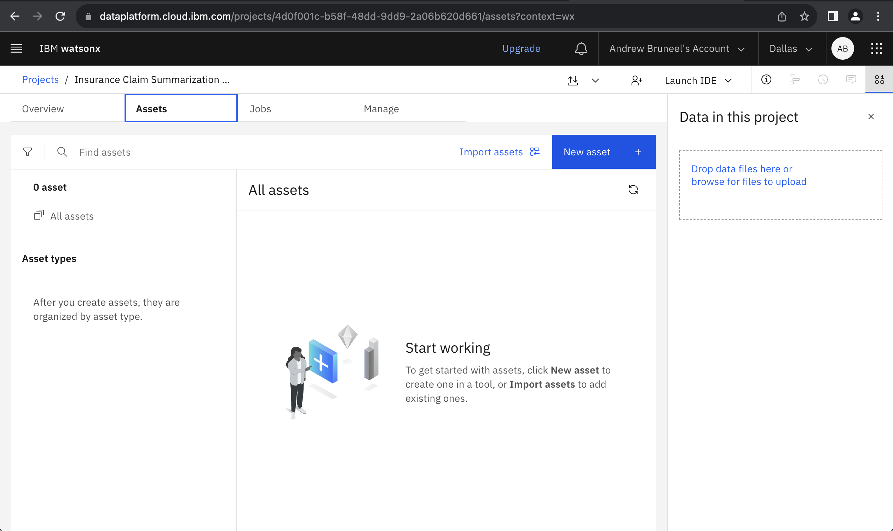

Now, if you scroll down on the menu that appears, you should see a card that says "Experiment with foundation models and build prompts". Select this to be taken into your first prompt with watsonx.governance!

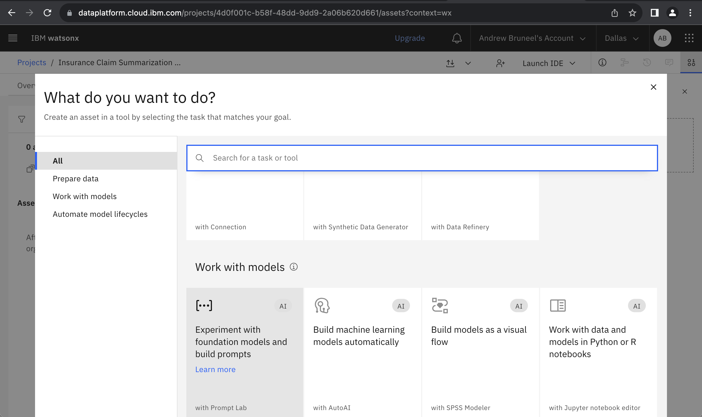

Once you select the prompt building card, you will be greeted with the following screen, which has numerous options on how you can configure your prompt to suit your needs. You will notice that there is a box labeled "Instruction" which is where we will be placing the bulk of our prompt to be evaluated later. Right above that, you see the option to select "Structured" or "Freeform". This lab will walk though utilizing the structured prompt functionality, however this is possible to do with freeform as well, so choose whichever option is the most comfortable for you! Structured prompts have easily identifiable sections to place examples, instructions, and prompt variables (which we will discuss later). Freeform prompts have a looser and more flexible structure. 

You will also see an icon with a graph at the top right, which is the button to run an evaluation that we will discuss later. You will be able to see the status of your work at the top right as well, indicating whether your prompt session work is Saved or Unsaved. Note that to run an evaluation, you will need to click the dropdown and save your work.

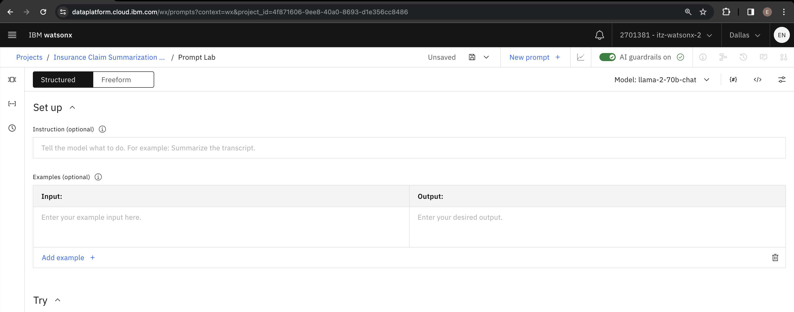

Inside of the Instruction box, enter your first prompt that we will be evaluating throughout this lab. We have a sample prompt shown in the directions that you will be able to modify later as the lab moves on. For now, enter the prompt shown in the screen below.

```
You are an insurance agent tasked to assess insurance claims. Summarize the following insurance claim input. Focus on the car and the damage. Make the summary at least 3 sentences long.
```


Now, we need to ensure that we are able to test our prompt against validation and test data. To do so, we need to ensure we have prompt variables set up for our instructions. By scrolling down your page, you will notice an area on the screen titled "Try". Inside of this, you want to put a variable inside of the input titled "{input}" and then click on the "prompt variables" button.

#### 1.1 Prompt Variables<a name="prompt-variables"></a>
---
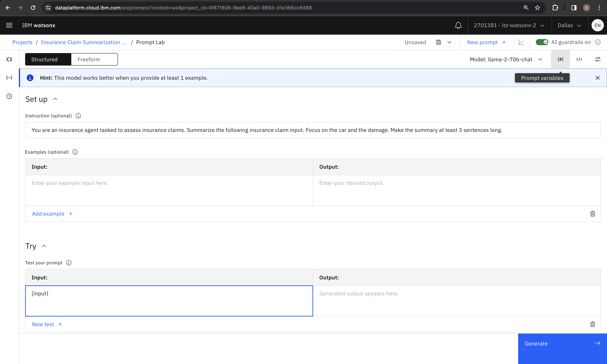

Once you have opened up that sidebar, you will see two empty boxes pop up, with "Variable" and "Default Value" able to be filled out. Use "input" again as the variable, and for the default value you can simply put "null" for the purpose of this lab, as none of our testing or validation data should have missing data.


Next to where you clicked prompt variables, you should see an option that says "Model parameters". Click on that next. We will not be making any serious changes here just yet, but mostly giving a tour of this section so you can make modifications later. Most importantly, when you first open the tab you will see a toggle for "Greedy" or "Sampling". Selecting Greedy will allow your model results to be reproducable across experiments, while selection "Sampling" will give you more robust outputs with the trade-off of variability. For our task of summarization, we will be choosing the Sampling option for this base prompt.

#### 1.2 Model Parameters<a name="model-parameters"></a>
---


Now that you have chosen Sampling, you will see several new options pop up that are specific to the Sampling decoding method. Temperature is the most important factor here, where setting a higher temperature will give higher variation and more unique outputs. Try setting this to 1 as I did in the following image. Mouse over the info icons to gain more information on Top P and Top K methods as well.

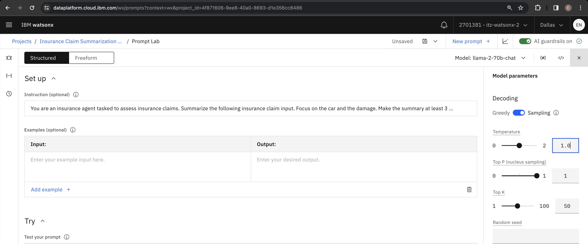

Lastly, scroll all the way down the Model parameters sidebar to find the stopping criteria as well as token limits. The default value for max tokens is 20. For LLMs, tokens ~ words, so we want to set that higher (e.g. 200) in order to get more detail in our summaries of the insurance claims.


#### 1.3 Saving Prompt<a name="saving-prompt"></a>
---
Once you are all finished, click the **Save** icon drop down in the top right, and then click **Save as**. This will take you to the following screen, where you will select your asset type, prompt template name, and task. Make sure to select the "Prompt template" option, then fill out a name in a similar fashion shown in the picture. From there, select **Summarization** for your task, and make sure to select **View in project after saving**.

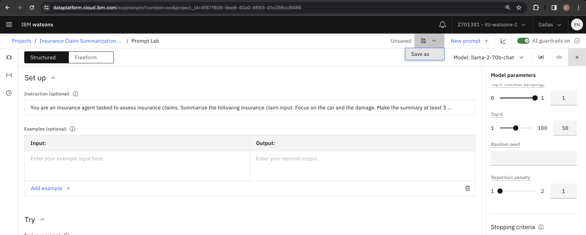


Great! Now you should see your finished prompt template on the screen when you are taken back to the Assets page. Verify that you have completed the previous steps correctly by clicking the 3 dots to the right of the prompt and choose **Evaluate**. We are going to be testing out our new prompt!

### 2. Evaluating Your Prompt<a name="evaluating-your-prompt"></a>
---


You should now see a screen pop up with an **Evaluate** button in the middle. Select that button. 


Now you will see a screen asking you which dimensions to evaluate. At this point, we are only able to evaluate GenAI quality (model health enabled by default). In lab 2, we will see that deployed prompts have more information that can be tracked.


Now it's time to choose our test data. For this tutorial, we will be using the [summarization validation data](data/Insurance%20claim%20summarization%20validation%20data.csv) and the [summarization test data](data/Insurance%20claim%20summarization%20test%20data.csv) found in the data folder of this lab's github repository. For now, just select the validation data for this step. We can use the test data for our work in [Step 6](#experiment-with-settings) if desired. Make sure you have both of these stored somewhere you can find them!

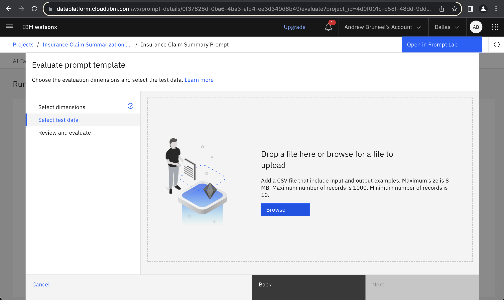

Now it's time to map the input variables to the input variable that we created earlier. Because I am using a CSV file, I chose the comma delimiter. Additionally, I chose "input" to be mapped to the Insurance_Claim column in my CSV file. This will ensure that my prompt is focused on summarizing the correct data. Lastly, "Reference output" is the column of the data that gives the expected output from our LLM where metrics will be evaluated against. This is how we can measure how effectively we have structured our prompts.


After that, you will see a screen to review the information you have entered. Once you verify that you have entered everything correctly, hit the "Evaluate" button. and wait until your prompt has finished being evaluated. This process can take up to a few minutes.


Once the evaluation has finished, you should see a screen pop up displaying the results. As you can see here, our evaluation was not very successful, triggering 13 alerts and failing its test. This is to be expected! The goal of this lab is to build on our first prompt that we have created here, and work to achieve better results so that we can deploy our prompt and eventually bring it to production.

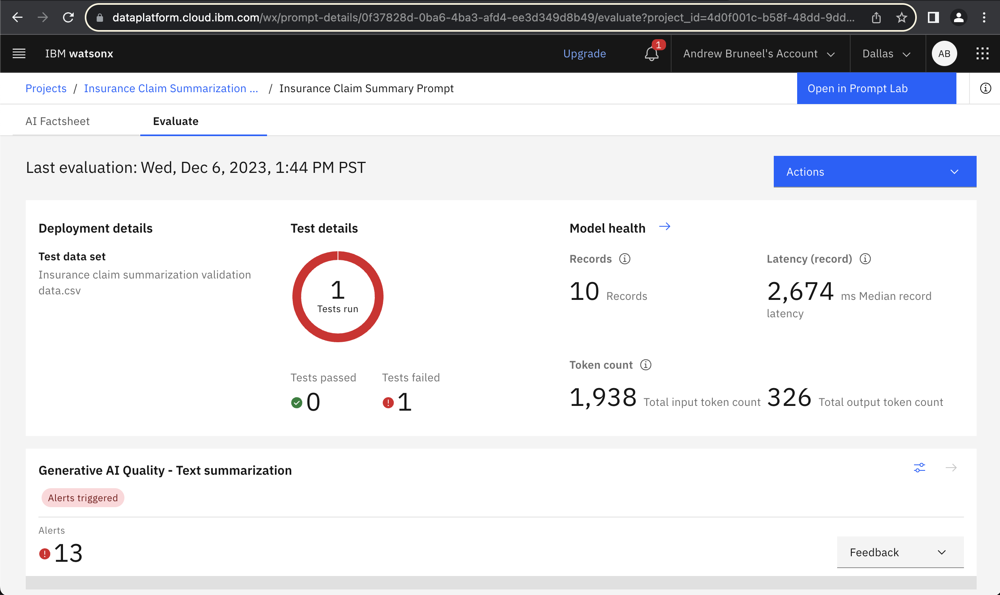

### 3. Alternative Way to Evaluate Prompt<a name="alternative-evaluation"></a>
---
For those interested, there is another way to run an evaluation from within the prompt session. As mentioned before, click on the top right icon showing a graph, which is the button to Evaluate.


If you haven’t already done so, it will ask you so save your work the same way as before. Then conveniently, you will be immediately directed to the page asking you to select your dimensions to evaluate, and proceed with the same process as [Step 2](#evaluating-your-prompt).

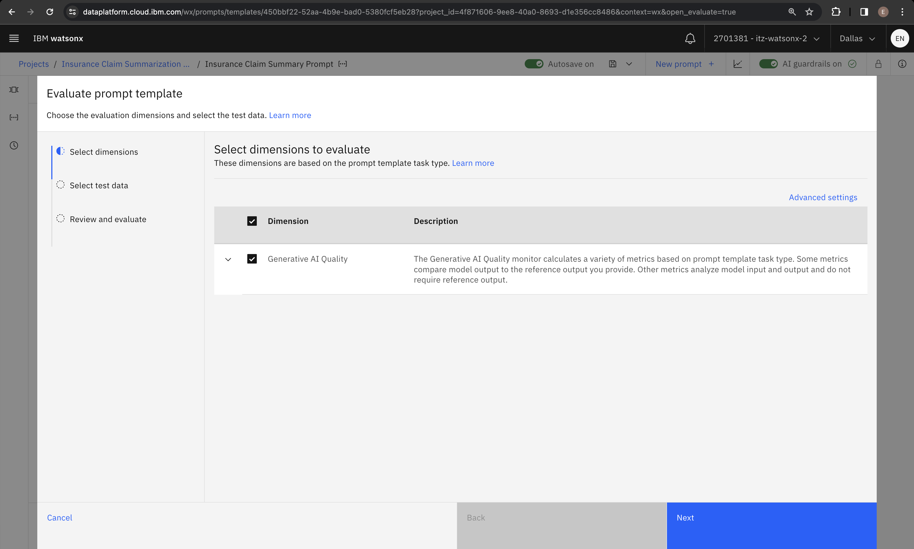

### 4. Evaluation Results<a name="evaluation-results"></a>
---


Scroll down the **Evaluate** page to see the specific metrics your prompt was evaluated on.  LLMs can be evaluated using an variety of metrics, and which metrics you use depends on the tasks your LLM is being asked to accomplish.


In this lab's use case, the LLM's task was Summarization which can be measured using a range of quality metrics. We recommend taking time now to scan through this documentation on the [generative AI quality metrics supported by watsonx.governance](https://dataplatform.cloud.ibm.com/docs/content/wsj/model/wos-monitor-gen-quality.html?context=wx&audience=wdp#supported-generative-ai-quality-metrics).

[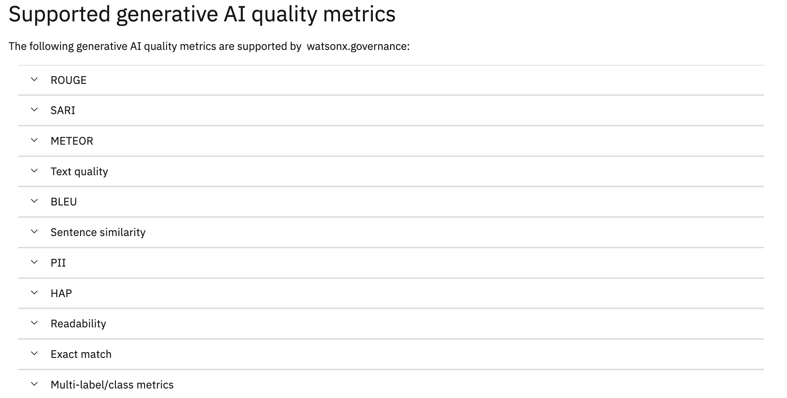](https://dataplatform.cloud.ibm.com/docs/content/wsj/model/wos-monitor-gen-quality.html?context=wx&audience=wdp#supported-generative-ai-quality-metrics)

After reading descriptions of those LLM evalation metrics, you likely realized the default display of metrics on the **Evaluation** page is not very useful.  Don't worry, you'll learn how to access a  more intuitive representation of these metrics on the AI Factsheet.

In the top left corner of your screen, choose the "AI Factsheet" tab, which will show us a better breakdown of the results we got. The first thing you will see on the page is an option to track your prompt in an AI use case. We will be covering this option in lab 2.

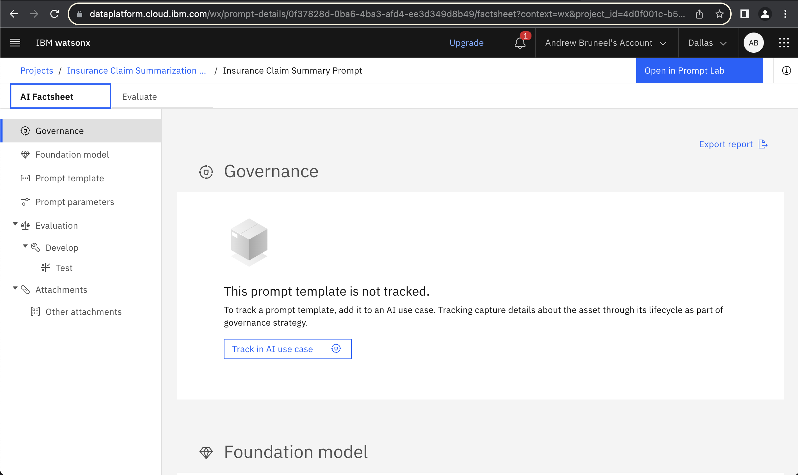

Scroll down the page to the "Generative AI Quality" section, and you will see visuals accompanying the metrics we saw earlier, and you will be able to see how close our prompt was to passing tests. For the majority, it looks like we have a lot of work to do still!


With the AI Factsheet open, take time to read through the [generative AI quality metrics supported by watsonx.governance](https://dataplatform.cloud.ibm.com/docs/content/wsj/model/wos-monitor-gen-quality.html?context=wx&audience=wdp#supported-generative-ai-quality-metrics). Comparing against the AI Fact Sheet, you can see that each metric has an upper and lower bounds with the ideal range indicated by the bolder portion at the left side of each metric's measurement.

The upside-down triangles represent the measured value for each metrics.  Black triangles good, Red triangles bad.  Look closely and you'll see that your evaluation has only three metrics that pass.

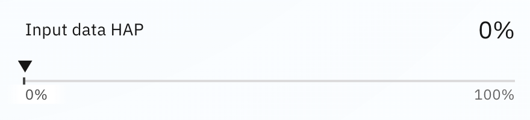


Every metric measuring the quality of a summarization output is in the red.  Hopefully you'll rise to the challenge, choose one of these metrics to improve and build a better prompt for this insurance summarization use case.

For now, though, I'll show you how to modify the thresholds for these metric so that your prompt can have looser requirements to pass testing. In a real world use case, this should only be done if absolutely necessary and makes sense for your use case! Head back over to the evaluation screen, where you will see a blue button to the right of "Generative AI Quality - Text Summarization" where we can adjust our thresholds.


Go ahead and click on that button, and you will be greeted with the following screen:


Here we are going to adjust the readability metric. This metric is higher if your model's generated responses to your prompt are easy to interpret, and lower if they are confusing to read. Scroll down the page and click the edit button to modify it.


Lastly, go ahead and change the readability slightly, say to 55, which puts the requirement into the "Fairly difficult to read" range. After, that, you can go ahead and click save to finalize your changes. Just a reminder here that these metrics should not be altered too much in a real world use case!

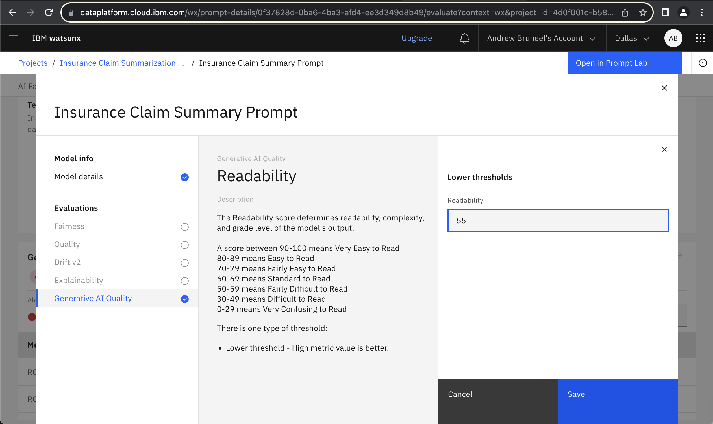

---
#### **Note: Please refer to [this powerpoint](resources/LLM_Metrics.PPTX) for more information on each metric!
---

### 5. Experimenting With New Prompts<a name="experimenting-with-new-prompts"></a>
---

Now that you've seen how to build your own prompt template and evaluate it against a test dataset, it's time to experiment! Your goal is to build a prompt template that will pass tests against the validation dataset provided to you in the lab. First, let's get you started by creating two copies of the existing prompt template that you can use to modify and play with. Click "Insurance Claim Summarization..." on the top left of your screen, the hyperlink just after "Projects". This should take you back to the "Assets" page, which will look something like this:


#### 5.1 Using Granite<a name="using-granite"></a>
---
Click back into your existing prompt, we're going to alter the LLM being used to generate summaries for us. Once you see the prompt screen back in front of you, turn off the "Autosave" setting on the page header. Then, click on the model selection dropdown and select "View all foundational models".


From here, let's choose IBM's granite-13b-chat-v2 as our new model for prompt summarization.


You'll see a page pop up displaying useful information about granite, as well as a blue "Select Model" button. Go ahead and click that once you're ready.


From here, we are going to "Save as" once again, which will create a new instance of a prompt template on our assets page.

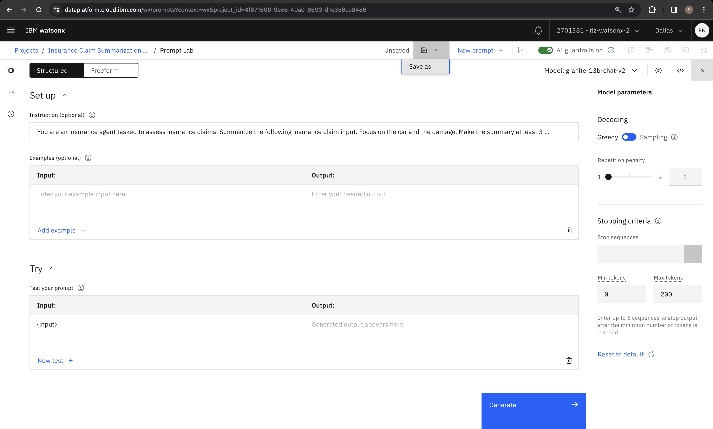

Fill out the information on the "Save Your Work" page as I have below. Make sure to put your model name inside of the "Name" field, this will be important when we make our next prompt template!


Great work -- now we should see our new template on the home page as well as our original template we created!

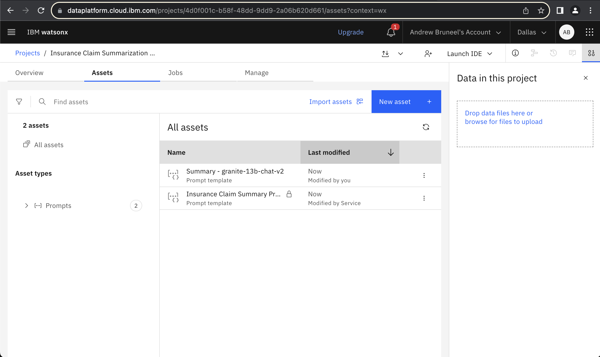

#### 5.2 Your Choice!<a name="your-choice"></a>
---
Now that you've seen how to quickly create copies of your original prompt template, you can assign new templates to a model of your choosing! Repeat the steps you took to create a prompt template evaluated with granite, but this time choose a new model (Making sure to click into the **original template** we created, not the granite template). It can be whatever you'd like! Make sure to **include the model name** in the naming of your new prompt template, as we did with granite. This will help you quickly differentiate between prompt templates later. Here is my Assets tab once I've added one more model:

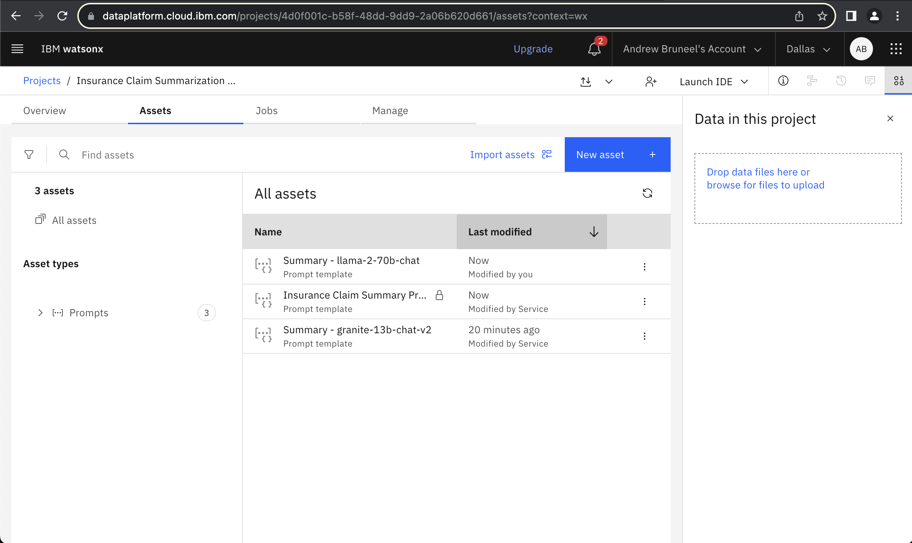

### 6. Experiment With Settings<a name="experiment-with-settings"></a>
---
Now that you've made it this far, you are ready to experiment and improve the performance of your prompts! The goal is for you to pass your evaluation against validation data using the tools you have at your disposal. Feel free to make any number of changes, including:

* Making new prompt templates with different models
* Changing the prompt instructions
* Providing examples (few shot prompting)
* Altering model parameters such as:
  * Greedy vs. Sampling
  * Temperature
  * Min/Max Tokens
  * Top P/Top K
  * Stop Sequence
* Evaluate prompt templates using different datasets

And any more changes you can think of! It may also be useful as a first step for you to take a close look at the validation data. From there, you can decide on which modifications to focus on that you think will be most effective at improving your results. Make sure to reference the previous steps from the lab if you have any questions, they should be able to answer most questions you have!

---
#### **Note: Remember that if you are having trouble, you can modify the thresholds for your evaluation **if needed**. Some thresholds have high default values that are unattainable even by state-of-the-art models, so if you find yourself consistently falling well beneath threshold values even after trying the solutions above, look into modifying your threshold values. The powerpoint shared in this lab's resources is a good resource to see which metrics may be useful to lower thresholds for.
---

Few shot prompting example:

Below is a brief example of using few shot prompting in the context of the data used for this lab. Make sure that when you decide to utilize few shot prompting, you are using **different** examples than what you have in your validation and test data, because otherwise you would be training your model on the exact scenarios it will see in test data, which is not a realistic scenario you would see in a real-world use case! This example shows a single shot, but feel free to add more to make your model more fine-tuned to your examples!

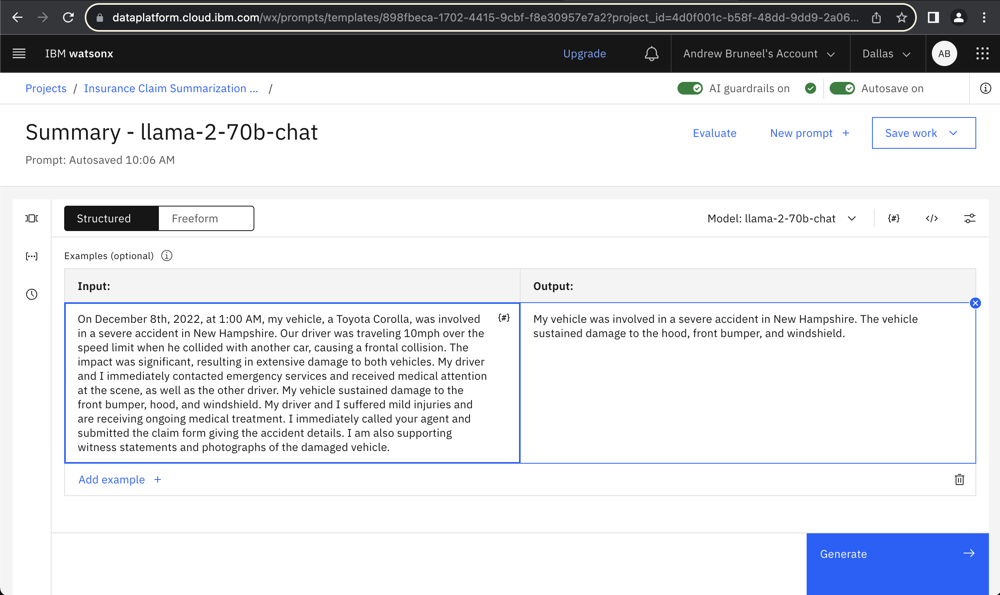

As you continue to make changes, your champion prompt with the best performance will be selected for use in the following lab!

<div align="center">
    
</div>
