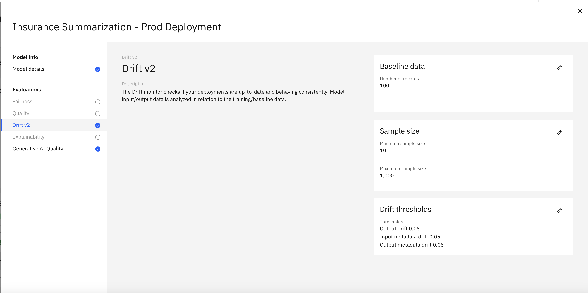

# Lab 2 - Model monitoring

In this lab, you will perform the tasks of a few different personae in the **AI Governance Lifecycle**.  You were a **Prompt Engineer**, in Lab 1, developing a high quality prompts.  Now you will explore roles in the broader **AI Development Team** as you learn to manage and deploy a "model".  Model is in quotes, as in this case, we refer to the combination a prompt (template) and the Large Language Model it uses - through the lens of an AI Use case and monitor its behavior at each stage of its lifecycle.

> Notes: 
> - This lab assumes that you have completed the previous lab, [Lab 1](../lab1-lifeycle-governance/). We will reuse the prompt that you have created there. 
> - The data sets that are used for evaluation and payload monitoring are located in the [data](./data/) folder of this repo. 
> - If you encounter some technical issues while working on the labs, please refer to this [troubleshooting document](https://github.ibm.com/client-engineering-watsonxai/watsonx.governance-bootcamp/blob/main/troubleshooting-tips.md). Feel free to add to it as well. 
> - At least some of the instructions below are kept deliberately vague. The intent here is to encourage you to become familiar with the relevant user interfaces, and that includes sometimes having to search for the right place and ways to navigate there.

    

## Table of Contents

  1. [Create a use case for governing prompts](#create-use-case)
  2. [Govern your first prompt](#govern-prompt-in-use-case)
  3. [Govern your second  prompt](#govern-second-prompt)
  4. [Deploy your prompt](#deploy-prompts)
  5. [Activate prompt monitoring](#monitor-prompt)

---
### 1. Create a use case for governing prompts<a name="create-use-case"/>
---
Go to the **AI Use Cases** screen and create a new use case. Give it a descriptive name and put it into state **Awaiting Development**.

For the rest of this lab, we will assume you reuse the prompt you created in Lab 1, called **Insurance Summarization Prompt**. If you feel ambitious, you can also create a new prompt and start from scratch. Make sure you test and evaluate the prompt if you do so.
But note that later steps in this lab use predefined data sets to simulate a drift situation. If you use your own prompt, you will also have to generate appropriate data sets, which may be a lengthy process. 

---
### 1. Govern your prompt <a name="govern-prompt-in-use-case"/>
---
Go the **AI Factsheet** tab for your prompt. See that the prompt template is not governed. We want to govern it, so let's add it to the use case we created above. Use the default approach. Make it **Experimental**. 

Note how it shows up as in **Development** in the use case. See how you have two places to get to this info, namely via the prompt and its factsheet, or via use cases.

Next, you will advance the status of your use case to **Development in progress**.  To do this, look for the Status section and click the Edit pencil icon.

In the popop window, select **Development in progress** and click **Apply**.

---
### 3. Govern your second  prompt <a name="govern-second-prompt"/>
---

We assume now that we want to make additional changes to the prompt, and use a new version. For that, create a new prompt that is a copy of the first one. Do that by opening it in prompt lab and use “Save as” to give it a new name. That opens it for editing again.

Play through the scenario that you may want to add another set of examples, or use a different model, or use different parameter settings. Use evaluations as a way to measure potential improvements. 
(Note that in order to track it separately in the use case, you have to make changes to it.)

Once you have a new version you are happy with, go to the **AI Factsheet**, add the prompt to the same use case then select **Minor Change** (version 0.1.0). Check that it appear in the **Use Case**.

These two prompts are now tracked separately within the same **Use Case**. Below, we will focus on the second prompt and take it through the lifecycle.

---
### 4. Deploy Prompts
---

Start by promoting the second prompt to a **Deployment Space**. Go to from the **Projects** view then select the **Promote** action for the three small circles icon to the right-side of your prmopt's name.

Create a new **Deployment Space** to promote your prompt into. Give the **Deployment Space** a unique name with **- Development** attached at the end so we can distinguish from other **Deployment Spaces** we'll be creating.

Select **Development** as the stage, select the default Storage service (itz-cos...) and select the listed machine learning service (itzml-...)

After promoting it, see how it appears in the use case in a new place.

Advance the status of the **Use Case** to **Ready for AI asset validation**.

Now go to the **Deployment Space** and see that the prompt hasn’t actually been deployed. Go to the **Deployment** section, then select the right space, click on **Assets** and then deploy the prompt. 

Then go back to the use case and see the prompt as **Pending Evaluation**.

---
### 5. Activate prompt monitoring<a name="monitor-prompt"/>
---

Go to the deployed prompt and pick the **Evaluations** tab. Select **Activate**.

Run another evaluation and check the results. It may seem redundant to run evaluations with the same prompt and the same data set over and over, but keep in mind that 
- The evaluations would potentially be performed by different people in different roles, e.g. the prompt developer would not be the one evaluating it for use in production,
- In a real world scenario, the data sets would differ between evaluations.

Note that in the use case, the status changes from **Pending** to **Evaluated**.

Change the use case status to **Validation complete**.

Go to the AI FactSheet of the prompt and export a report in PDF format. Familiarize yourself with the content of the report.

Now create another deployment space as stage **Production** and give it a unique name with **- Production** attached at the end. Then promote the prompt to it.

See how the use case is updated to show the prompt under **Operate**. But it’s not actually deployed yet, so let’s do that, too.

It’s pending evaluation, so let’s run yet another evaluation. See how when you activate the monitoring, it now shows **Drift v2** as an additional option. It also describes how payload data must have column that match the input variables of the prompt.

Once the prompt is deployed into production, we can test it to make sure it is functioning as expected. Open the prompt in the **Deployment Space** and select the **Test** tab.

Click on **Generate** to make sure the prompt works.

Review the schemas of the Payload and the Feedback data. The CSV files we upload later need to follow these schemas.

We are now ready to prime the prompt deployment with baseline data. You can use the **Insurance claim summarization drift payload 0 - baseline.csv** file to do so. Upload this file as the payload data. We are not uploading any feedback data at this point.

Click on **Evaluate now**. It should result in a passed test.

If you now select **Configure monitors** in the **Action** menu, you see that **Drift v2** is enabled, you have a baseline of 100 records and you can edit the threshold values here, too. In a real world scenario, these thresholds should be adjusted to the concrete use case and prompt. But we'll leave that to an advanced lab and won't change them now.

The system will now monitor invocations of the prompt and detect potential drift. To simulate a drift example, you can upload a number of data files, named **Insurance claim summarization drift payload [1 hrough 4].csv**. Upload all of them as Payload data. Let some time pass between the runs, so that it shows a meaningful timeline. Once you have run these evaluations, you will see another diagram show up on the screen, namely for the Drift.

You can click on the blue arrow in the top right corner of that section to get a more detailed view.

Make sure you have selected the right time settings to see the drift change over time. There are only three criteria which go into the drift calculations: "output", "output metadata drift" and "input metadata drift". 

These measurements say nothing about the quality of the prompt. To measure it, we need to upload feedback data. Go to the **Evaluations** tab and click on **Actions** -> **Evaluate now**. Upload the [Insurance claim summarization feedback.csv](./data/Insurance%20claim%20summarization%20feedback.csv) file.

When the run is finished, you can see a panel with **Generative AI Quality - Text summarization** metrics on the lower right of the screen. Click on the blue arrow in the top right corner to get a more detailed view of the metrics collected.

Pending here is a more detailed discussion of the various metrics, what scores to expect and how the thresholds should be set that lead to a potential alert.

Finally, we are ready to advance the status of the use case to **in operation**. The prompt is deployed in production and is being monitored for drift and quality. Given that the evaluations failed at some steps along the way, we may want to also change the **Risk level** to **Medium**.
 

    

